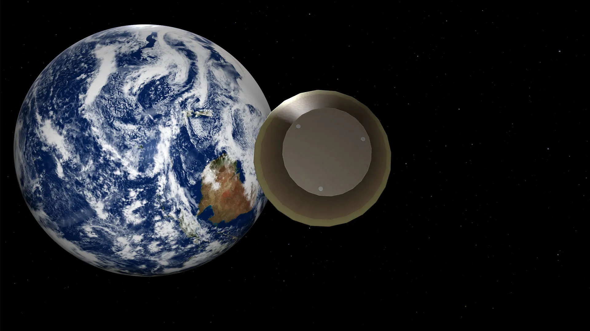

# NASA API
---
This is a simple and quick example of working with [NASA API](https://api.nasa.gov/) and getting information from it 

> :bulb: **Tip:** I recommend this site to learn information about your [latlong](https://www.latlong.net/)

> :bulb: **Tip:** I recommend the following extension to display [JSON](https://chrome.google.com/webstore/detail/json-viewer-pro/eifflpmocdbdmepbjaopkkhbfmdgijcc/related) information in a nice and formatted format

